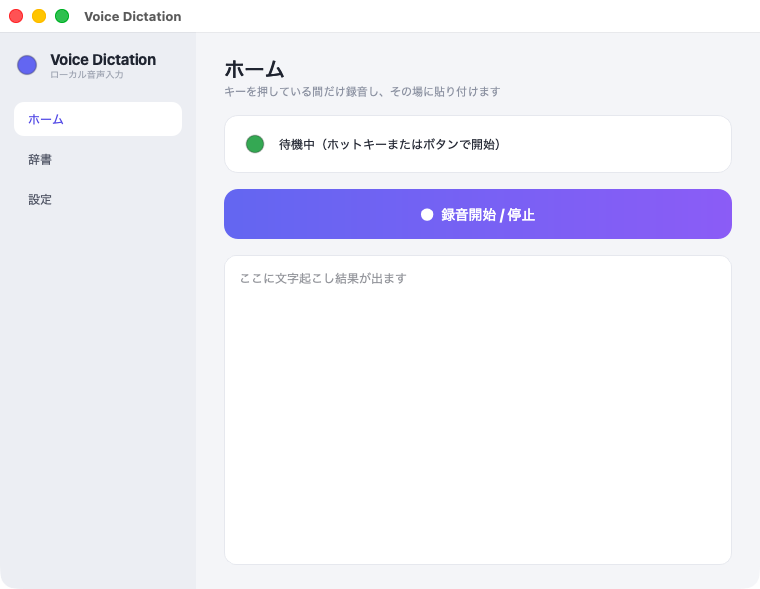
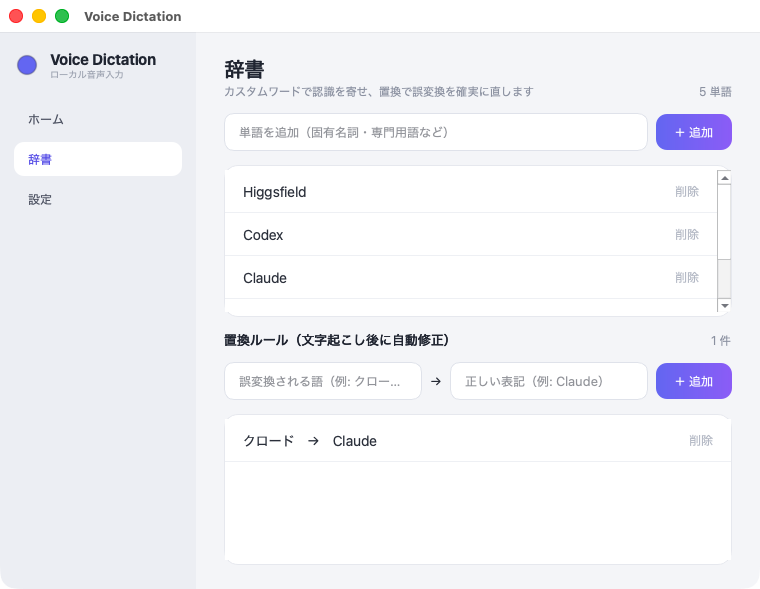

# voice-dictation — superwhisper風ローカル音声入力（GUIアプリ）

macOS（Apple Silicon）用の、ホットキーで喋ると文字起こしして今のカーソル位置へ貼り付けるアプリです。
文字起こしは `mlx-whisper` / `mlx-audio` で**完全ローカル・オフライン**。音声は外部に一切送りません。
モデルはWhisper系（large-v3-turbo等）のほか、日本語特化の kotoba-whisper v2.0 と Qwen3-ASR（0.6B / 1.7B）を設定画面から選べます。

<p align="center"></p>

## セットアップ（ソースから）

```bash
git clone https://github.com/shinjetters-png/voice-dictation.git ~/voice-dictation
cd ~/voice-dictation
python3 -m venv .venv
.venv/bin/pip install -r requirements.txt
```

> `VoiceDictation.app` のランチャーは `~/voice-dictation` にリポジトリがある前提で動きます。
> 別の場所に置く場合は `VoiceDictation.app/Contents/MacOS/VoiceDictation` の `DIR` を書き換えてください。

## 使い方（GUIアプリ）

1. **`VoiceDictation.app` をダブルクリック**して起動します（`~/voice-dictation/VoiceDictation.app`）。
   よく使うなら `/Applications` にコピーしておくと Launchpad からも開けます。
   初回はモデル（約1.6GB）を自動ダウンロードします。ウィンドウ上部が「待機中」になれば準備完了です。

2. **右⌥（Option）キーを押している間だけ録音** → 離すと文字起こし＆自動貼り付け。
   ウィンドウの「● 録音開始 / 停止」ボタンでも操作できます。

3. ウィンドウを閉じてもメニューバーのマイクアイコンに常駐します（クリックで「ウィンドウを表示／終了」。状態で 白＝待機／赤＝録音中／黄＝処理中）。

> **メニューバーアイコンについての注意**
> - アイコンは macOS の仕様で「**主ディスプレイ**」のメニューバーにだけ出ます。複数モニターの場合、システム設定 › ディスプレイで白い横棒（メニューバー）が乗っている画面を見てください。移したい場合はその横棒を目的の画面へドラッグします。
> - このアプリは起動時に一瞬だけ通常アプリとして立ち上がり、直後に常駐アプリへ切り替わります（アイコンを描画させてから Command+Tab / Dock から外すため）。`.app` は Python を独立プロセスとして起動する仕組みになっており、これによりメニューバー表示と Command+Tab 非表示を両立しています。

設定（モデル・言語・方式・キー・語彙ヒント・自動貼り付け）はウィンドウ内で変更し、「設定を保存して反映」を押すだけです。`config.json` を直接編集しても構いません。

> ターミナルから起動して不具合を見たいときは `~/voice-dictation/run.sh`（menu-bar版）や、GUI版のログ `~/voice-dictation/app.log` を確認してください。

## 必要な権限（初回のみ・System Settings › Privacy & Security）

起動元（Terminal / iTerm など）に対して以下を許可してください。うまく動かないときはほぼ権限が原因です。

- **マイク（Microphone）** … 録音のため
- **アクセシビリティ（Accessibility）** … ホットキー検知と自動貼り付けのため
- （自動貼り付けが効かない場合）**オートメーション（Automation）で System Events を許可**

権限を変えたあとはアプリを一度終了して再起動してください。

## 設定（config.json）

| キー | 意味 |
|------|------|
| `model` | 文字起こしモデル。既定 `mlx-community/whisper-large-v3-turbo`。日本語特化なら `kaiinui/kotoba-whisper-v2.0-mlx`、新世代の `mlx-community/Qwen3-ASR-1.7B-8bit` / `0.6B-8bit` も選択可。軽くしたいなら `mlx-community/whisper-small` |
| `language` | `"ja"` 固定。自動判定は `""`（空）に |
| `mode` | `"hold"`（押している間録音）/ `"toggle"`（キーで開始・停止） |
| `hold_key` | holdモードのキー。`alt_r`（右⌥）/ `cmd_r`（右⌘）/ `ctrl_r` / `shift_r` |
| `toggle_hotkey` | toggleモードの組合せ。例 `"<ctrl>+<alt>+d"` |
| `paste` | `true` で自動貼り付け。`false` ならクリップボードに入れるだけ |
| `play_sounds` | 開始・完了の効果音 |
| `initial_prompt` | 固有名詞など、認識を寄せたい語を入れておける（例：`"Claude, Obsidian"`） |
| `transcribe_temperatures` | デコード温度。既定は `[0.0]`。再試行温度を足すと聞き取れない音声で幻覚が出やすいため非推奨 |
| `rewarm_enabled` | 長時間休止後、次の録音中にモデルを再ウォームアップする |
| `rewarm_after_seconds` | 再ウォームアップを行う休止時間。既定は600秒（10分） |

変更後はアプリを再起動してください（ホットキー系は再起動で反映）。

## 辞書と置換ルール（辞書タブ）

<p align="center"></p>

- **単語** … モデルへのヒントとして渡し、固有名詞や専門用語の認識を寄せます（Whisper系は initial_prompt、Qwen3-ASR は文脈バイアスとして渡すので特に効果的です）。
- **置換ルール** … 文字起こし後のテキストに必ず適用され、毎回出る誤変換をその場で直します（例：`クロード → Claude`）。ヒントで当たる確率を上げ、外れたら置換で拾う二段構えです。

どちらも `dictionary.json` に保存されます（ローカル専用・コミット対象外）。

## ログイン時に自動起動したいとき

`~/Library/LaunchAgents/com.sai.voice-dictation.plist` を作って `launchctl load` する方法があります。必要になったら声をかけてください。
